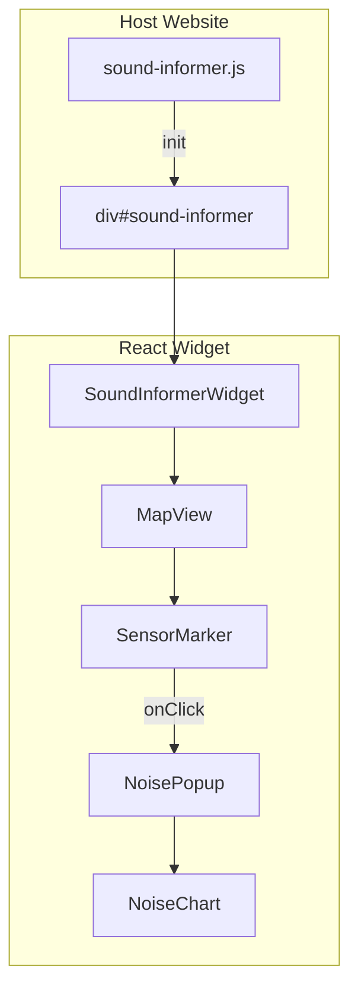
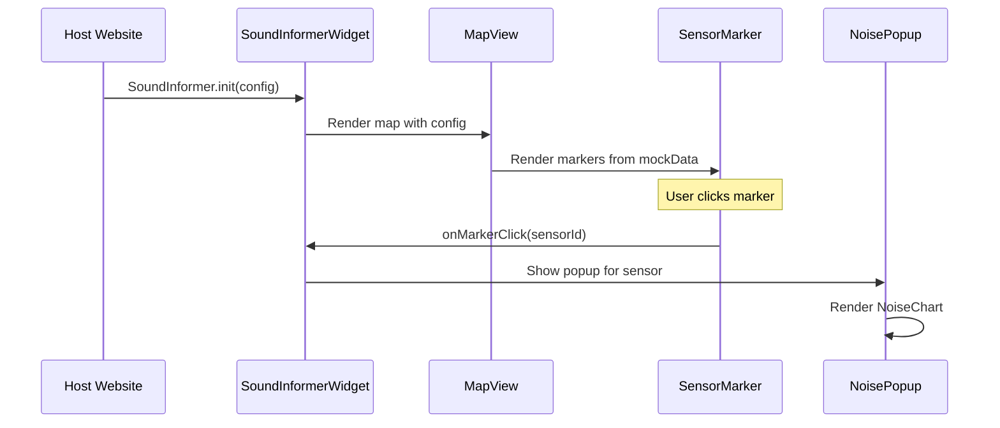

# System Patterns: Sound Informer Widget

## System Architecture

### Общая архитектура

```
Host Website
  └── <div id="sound-informer"></div>
  └── <script src="sound-informer.js"></script>
       └── SoundInformer.init(config)
            └── React Widget (SoundInformerWidget)
                 └── MapView (react-map-gl)
                      ├── SensorMarker[] (маркеры датчиков)
                      └── NoisePopup (при клике на маркер)
                           └── NoiseChart (recharts)
```

### Компонентная архитектура



### Поток данных



## Key Technical Decisions

### 1. Vite Library Mode
**Решение**: Использование Vite в режиме библиотеки для сборки виджета в один JS файл (IIFE формат)

**Обоснование**:
- Простота интеграции — один файл для подключения
- Все зависимости бандлятся вместе
- Не требует сборки на стороне хост-сайта

**Конфигурация**:
```typescript
build: {
  lib: {
    entry: 'src/widget.tsx',
    name: 'SoundInformer',
    fileName: 'sound-informer',
    formats: ['iife']
  },
  rollupOptions: {
    output: {
      inlineDynamicImports: true
    }
  }
}
```

### 2. React 19.x + TypeScript
**Решение**: Использование последней версии React с TypeScript для строгой типизации

**Обоснование**:
- Современные возможности React
- Типобезопасность
- Лучшая поддержка инструментов разработки

### 3. Mapbox GL через react-map-gl
**Решение**: Использование react-map-gl как React обёртки для Mapbox GL

**Обоснование**:
- Интеграция с React экосистемой
- Удобный API для работы с картой
- Поддержка современных возможностей Mapbox

### 4. Изоляция стилей через префиксы
**Решение**: Использование префикса `si-` для всех CSS классов виджета

**Обоснование**:
- Предотвращение конфликтов со стилями хост-сайта
- Простота реализации (без Shadow DOM)
- Возможность добавления Shadow DOM в будущем при необходимости

### 5. Mock данные на первом этапе
**Решение**: Использование фейковых данных для демонстрации функциональности

**Обоснование**:
- Быстрая разработка без зависимости от backend
- Возможность тестирования всех компонентов
- Backend будет реализован позже

## Design Patterns in Use

### 1. Component Composition
Компоненты построены по принципу композиции:
- `SoundInformerWidget` композирует `MapView`
- `MapView` композирует `SensorMarker[]`
- `NoisePopup` композирует `NoiseChart`

### 2. Props Drilling (управляемый)
Конфигурация передается через props от корневого компонента к дочерним:
- `SoundInformerWidget` получает config
- Передает необходимые части в `MapView`
- `MapView` передает данные в `SensorMarker`

### 3. Event Handling Pattern
Обработка событий через callback функции:
- `onMarkerClick(sensorId)` — обработка клика по маркеру
- `onClosePopup()` — закрытие popup
- События всплывают от дочерних компонентов к родительским

### 4. Configuration Object Pattern
Вся конфигурация передается через один объект:
```typescript
interface SoundInformerConfig {
  container: string;
  mapboxToken: string;
  center?: [number, number];
  zoom?: number;
  height?: number | string | 'auto';
  locale?: 'en' | 'fr' | 'es' | 'ru';
}
```

### 5. Factory Pattern для инициализации
Глобальный объект `SoundInformer` с методом `init()`:
```typescript
SoundInformer.init(config);
```

## Component Relationships

### SoundInformerWidget (корневой компонент)
- **Роль**: Главный компонент виджета, управляет состоянием и конфигурацией
- **Зависимости**: MapView, типы конфигурации
- **Состояние**: выбранный датчик для popup, конфигурация

### MapView
- **Роль**: Отображение карты Mapbox и управление маркерами
- **Зависимости**: react-map-gl, SensorMarker, NoisePopup
- **Props**: config (центр, zoom, токен), sensors (массив датчиков), onMarkerClick

### SensorMarker
- **Роль**: Отображение маркера датчика на карте
- **Зависимости**: данные датчика (Sensor)
- **Props**: sensor (данные датчика), onClick callback
- **Логика**: определение цвета по уровню шума

### NoisePopup
- **Роль**: Всплывающее окно с информацией о датчике
- **Зависимости**: NoiseChart, данные датчика
- **Props**: sensor (данные датчика), readings (измерения), onClose callback
- **Позиционирование**: рядом с выбранным маркером

### NoiseChart
- **Роль**: Отображение столбчатого графика почасовых измерений
- **Зависимости**: recharts
- **Props**: readings (массив NoiseReading)
- **Логика**: группировка по часам, цветовая индикация

## Critical Implementation Paths

### 1. Инициализация виджета
```
window.SoundInformer.init(config)
  → Проверка конфигурации
  → Поиск контейнера в DOM
  → Создание React root
  → Рендер SoundInformerWidget
  → Инициализация MapView с токеном
```

### 2. Отображение маркеров
```
SoundInformerWidget
  → Загрузка mockSensors
  → Передача в MapView
  → MapView рендерит SensorMarker для каждого датчика
  → Определение цвета по currentLevel
```

### 3. Открытие popup
```
Пользователь кликает на SensorMarker
  → onMarkerClick(sensorId)
  → SoundInformerWidget обновляет состояние (selectedSensor)
  → MapView получает selectedSensor
  → Рендерит NoisePopup рядом с маркером
  → NoisePopup генерирует данные графика (generateMockReadings)
  → Рендерит NoiseChart
```

### 4. Генерация данных графика
```
generateMockReadings(sensorId)
  → Находит базовый уровень шума датчика
  → Генерирует 24 записи (по одной на час)
  → Добавляет случайное отклонение ±10 дБ
  → Возвращает массив NoiseReading[]
```

## Структура файлов

```
sound-informer/
├── src/
│   ├── main.tsx                    # Entry point для разработки
│   ├── widget.tsx                  # Entry point для сборки виджета
│   ├── App.tsx                     # Компонент для разработки
│   │
│   ├── components/
│   │   ├── SoundInformerWidget.tsx # Главный компонент виджета
│   │   ├── MapView.tsx             # Карта Mapbox
│   │   ├── SensorMarker.tsx        # Маркер датчика
│   │   ├── NoisePopup.tsx          # Popup окно
│   │   └── NoiseChart.tsx          # Столбчатый график
│   │
│   ├── ui/                         # shadcn компоненты
│   │   ├── card.tsx
│   │   └── button.tsx
│   │
│   ├── data/
│   │   └── mockSensors.ts          # Фейковые данные
│   │
│   ├── types/
│   │   └── index.ts                # TypeScript типы
│   │
│   ├── lib/
│   │   └── utils.ts                # Утилиты (cn, etc.)
│   │
│   └── styles/
│       └── index.css               # Tailwind + кастомные стили
```
