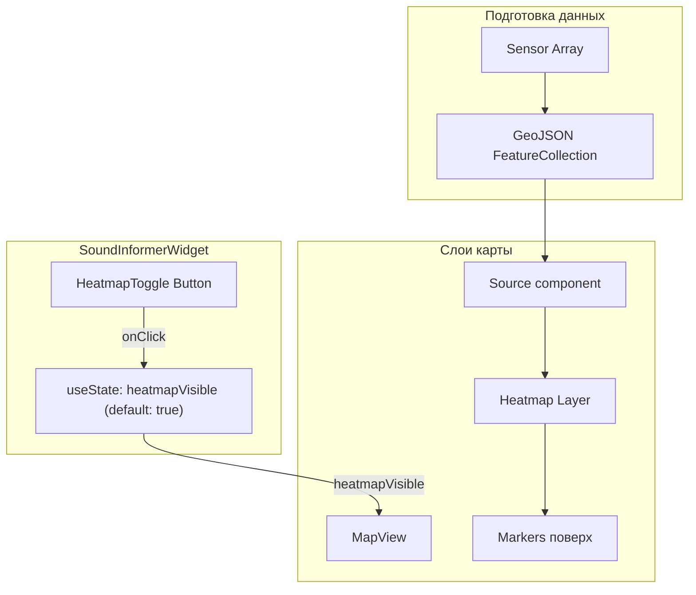

# План реализации Heatmap слоя

## Архитектура



## Поведение по умолчанию

- Heatmap: **включен** (visible)
- Маркеры: **всегда видимы** (не скрываются при toggle)
- Кнопка toggle позволяет показать/скрыть только heatmap слой

## Файлы для изменения

### 1. Типы: [sound-informer/src/types/index.ts](sound-informer/src/types/index.ts)

Добавить новый параметр в `SoundInformerConfig`:

```typescript
interface SoundInformerConfig {
  // ... существующие поля
  /** Показывать тепловую карту шума (по умолчанию: true) */
  showHeatmap?: boolean;
}
```

### 2. Утилита GeoJSON: [sound-informer/src/data/mockSensors.ts](sound-informer/src/data/mockSensors.ts)

Добавить функцию преобразования сенсоров в GeoJSON:

```typescript
export function sensorsToGeoJSON(sensors: Sensor[]): GeoJSON.FeatureCollection {
  return {
    type: 'FeatureCollection',
    features: sensors.map((sensor) => ({
      type: 'Feature',
      properties: { level: sensor.currentLevel },
      geometry: { type: 'Point', coordinates: sensor.coordinates }
    }))
  };
}
```

### 3. Конфигурация heatmap слоя: создать [sound-informer/src/components/heatmapLayer.ts](sound-informer/src/components/heatmapLayer.ts)

Вынести конфигурацию слоя в отдельный файл:

```typescript
import type { HeatmapLayer } from 'react-map-gl';

export const noiseHeatmapLayer: HeatmapLayer = {
  id: 'noise-heatmap',
  type: 'heatmap',
  source: 'sensors',
  paint: {
    'heatmap-weight': ['interpolate', ['linear'], ['get', 'level'], 30, 0, 90, 1],
    'heatmap-intensity': ['interpolate', ['linear'], ['zoom'], 0, 1, 9, 3],
    'heatmap-color': [
      'interpolate', ['linear'], ['heatmap-density'],
      0, 'rgba(0,0,0,0)',
      0.2, '#22c55e',  // green
      0.4, '#eab308',  // yellow
      0.6, '#f97316',  // orange
      0.8, '#ef4444',  // red
      1, '#dc2626'
    ],
    'heatmap-radius': ['interpolate', ['linear'], ['zoom'], 0, 2, 5, 20, 10, 40],
    'heatmap-opacity': 0.7
  }
};
```

### 4. MapView: [sound-informer/src/components/MapView.tsx](sound-informer/src/components/MapView.tsx)

- Добавить импорты `Source`, `Layer` из `react-map-gl`
- Добавить prop `showHeatmap: boolean`
- Добавить `useMemo` для GeoJSON данных
- Рендерить `Source` + `Layer` перед маркерами

### 5. Локализация: [sound-informer/src/lib/i18n.ts](sound-informer/src/lib/i18n.ts)

Добавить строки для кнопки toggle:

```typescript
// Добавить в translations
heatmapShow: {
  en: 'Show Heatmap',
  fr: 'Afficher la carte thermique',
  es: 'Mostrar mapa de calor',
  ru: 'Показать тепловую карту'
},
heatmapHide: {
  en: 'Hide Heatmap',
  fr: 'Masquer la carte thermique',
  es: 'Ocultar mapa de calor',
  ru: 'Скрыть тепловую карту'
}
```

### 6. Компонент кнопки: создать [sound-informer/src/components/HeatmapToggle.tsx](sound-informer/src/components/HeatmapToggle.tsx)

Кнопка toggle в правом верхнем углу карты:

```typescript
interface HeatmapToggleProps {
  visible: boolean;
  locale: Locale;
  onToggle: () => void;
}

export function HeatmapToggle({ visible, locale, onToggle }: HeatmapToggleProps) {
  const label = visible ? t('heatmapHide', locale) : t('heatmapShow', locale);
  
  return (
    <button
      onClick={onToggle}
      className="si-absolute si-top-2 si-right-2 si-z-10 si-bg-white si-px-3 si-py-1.5 si-rounded si-shadow si-text-sm"
    >
      {label}
    </button>
  );
}
```

### 7. SoundInformerWidget: [sound-informer/src/components/SoundInformerWidget.tsx](sound-informer/src/components/SoundInformerWidget.tsx)

- Добавить `useState` для `heatmapVisible` (default: `true`)
- Добавить `HeatmapToggle` кнопку внутри контейнера карты
- Прокинуть `showHeatmap={heatmapVisible}` в `MapView`
```typescript
const [heatmapVisible, setHeatmapVisible] = useState(true);

// В JSX, внутри div с картой:
<div className="si-flex-grow si-relative">
  <HeatmapToggle
    visible={heatmapVisible}
    locale={locale}
    onToggle={() => setHeatmapVisible(!heatmapVisible)}
  />
  <MapView
    // ... существующие props
    showHeatmap={heatmapVisible}
  />
</div>
```


## Цветовая схема (из спецификации)

- Low (до 50 dB): `#22c55e` (green)
- Moderate (до 70 dB): `#eab308` (yellow)
- High (до 85 dB): `#f97316` (orange)
- Dangerous (85+ dB): `#ef4444` (red)