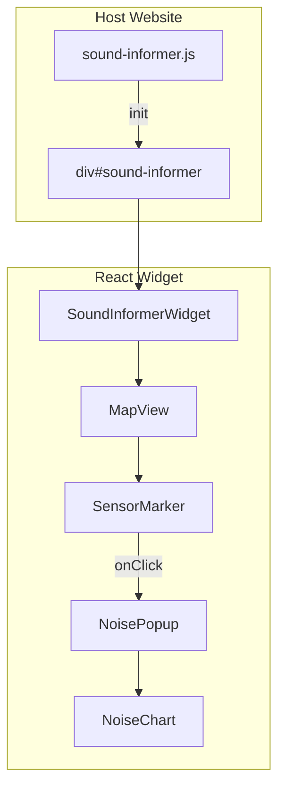
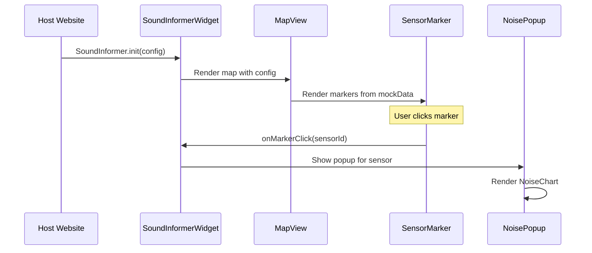

# Техническое задание: Sound Informer Widget

## 1. Общее описание проекта

### 1.1 Назначение
Sound Informer Widget — встраиваемый виджет для отображения интерактивной карты с точками расположения датчиков мониторинга шумового загрязнения. Виджет предназначен для интеграции на сторонние веб-сайты без необходимости модификации существующего кода.

### 1.2 Целевая аудитория
- Владельцы сайтов экологических организаций
- Муниципальные порталы
- Информационные ресурсы о качестве городской среды

### 1.3 Ключевые особенности
- Простая интеграция через подключение одного JS файла
- Интерактивная карта с маркерами датчиков
- Popup-окна с графиками уровня шума при клике на маркер
- Адаптивный дизайн (заполняет размер контейнера)
- Фейковые данные для демонстрации (backend будет реализован позже)

---

## 2. Функциональные требования

### 2.1 Карта

| Требование | Описание |
|------------|----------|
| FR-MAP-01 | Отображение интерактивной карты Mapbox |
| FR-MAP-02 | Поддержка zoom (приближение/отдаление) |
| FR-MAP-03 | Поддержка pan (перетаскивание карты) |
| FR-MAP-04 | Настраиваемый начальный центр карты |
| FR-MAP-05 | Настраиваемый начальный уровень zoom |

### 2.2 Маркеры датчиков

| Требование | Описание |
|------------|----------|
| FR-MARKER-01 | Отображение маркеров в местах расположения датчиков |
| FR-MARKER-02 | Визуальная индикация уровня шума цветом маркера |
| FR-MARKER-03 | Hover-эффект при наведении на маркер |
| FR-MARKER-04 | Клик по маркеру открывает popup с графиком |

### 2.3 Popup с графиком

| Требование | Описание |
|------------|----------|
| FR-POPUP-01 | Popup отображается рядом с выбранным маркером |
| FR-POPUP-02 | Содержит название/ID датчика |
| FR-POPUP-03 | Содержит столбчатый график уровня шума |
| FR-POPUP-04 | Данные графика — почасовые измерения за последние 24 часа |
| FR-POPUP-05 | Кнопка закрытия popup |
| FR-POPUP-06 | Закрытие при клике вне popup |

### 2.4 Встраивание

| Требование | Описание |
|------------|----------|
| FR-EMBED-01 | Инициализация через глобальный объект `SoundInformer` |
| FR-EMBED-02 | Привязка к DOM-элементу по CSS-селектору |
| FR-EMBED-03 | Передача Mapbox API токена через конфигурацию |
| FR-EMBED-04 | Настройка центра и zoom через конфигурацию |

---

## 3. Технический стек

### 3.1 Основные технологии

| Технология | Версия | Назначение |
|------------|--------|------------|
| React | 19.x | UI фреймворк |
| TypeScript | 5.x | Типизация |
| Vite | 7.x | Сборка (library mode) |
| Tailwind CSS | 3.x | Стилизация |
| shadcn/ui | latest | UI компоненты |

### 3.2 Библиотеки для карт и графиков

| Библиотека | Версия | Назначение |
|------------|--------|------------|
| mapbox-gl | 3.x | Рендеринг карты |
| react-map-gl | 7.x | React обёртка для Mapbox |
| recharts | 2.x | Графики (совместим с shadcn) |

### 3.3 Дополнительные зависимости

| Библиотека | Назначение |
|------------|------------|
| clsx | Условные CSS классы |
| tailwind-merge | Объединение Tailwind классов |

---

## 4. Архитектура

### 4.1 Диаграмма компонентов



### 4.2 Поток данных



### 4.3 Структура проекта

```
sound-informer/
├── src/
│   ├── main.tsx                    # Entry point для разработки
│   ├── widget.tsx                  # Entry point для сборки виджета
│   ├── App.tsx                     # Компонент для разработки
│   │
│   ├── components/
│   │   ├── SoundInformerWidget.tsx # Главный компонент виджета
│   │   ├── MapView.tsx             # Карта Mapbox
│   │   ├── SensorMarker.tsx        # Маркер датчика
│   │   ├── NoisePopup.tsx          # Popup окно
│   │   └── NoiseChart.tsx          # Столбчатый график
│   │
│   ├── ui/                         # shadcn компоненты
│   │   ├── card.tsx
│   │   └── button.tsx
│   │
│   ├── data/
│   │   └── mockSensors.ts          # Фейковые данные
│   │
│   ├── types/
│   │   └── index.ts                # TypeScript типы
│   │
│   ├── lib/
│   │   └── utils.ts                # Утилиты (cn, etc.)
│   │
│   └── styles/
│       └── index.css               # Tailwind + кастомные стили
│
├── public/
│   └── vite.svg
│
├── index.html                      # HTML для разработки
├── package.json
├── vite.config.ts                  # Конфигурация Vite
├── tailwind.config.ts              # Конфигурация Tailwind
├── tsconfig.json
└── components.json                 # Конфигурация shadcn
```

---

## 5. Типы данных

### 5.1 Конфигурация виджета

```typescript
interface SoundInformerConfig {
  /** CSS-селектор контейнера для виджета */
  container: string;
  
  /** 
   * Public Mapbox токен с URL restrictions
   * ВАЖНО: В настройках Mapbox укажите домены, где разрешено использование
   * Документация: https://docs.mapbox.com/help/troubleshooting/how-to-use-mapbox-securely/
   * 
   * Токен передается в открытом виде в клиентском коде, поэтому обязательно:
   * 1. Используйте Public token (не Secret token)
   * 2. Настройте URL restrictions в Mapbox Dashboard
   * 3. Ограничьте список разрешенных доменов
   */
  mapboxToken: string;
  
  /** Начальный центр карты [longitude, latitude] (по умолчанию Париж) */
  center?: [number, number];
  
  /** Начальный уровень zoom (1-22) */
  zoom?: number;
  
  /** 
   * Высота виджета
   * - number: фиксированная высота в пикселях (например, 400)
   * - string: CSS значение ('50vh', '400px', '100%')
   * - 'auto': автоматический aspect-ratio 16:9 (адаптивный)
   * По умолчанию: 400 (пикселей)
   */
  height?: number | string | 'auto';
  
  /** 
   * Локализация интерфейса
   * По умолчанию определяется автоматически по navigator.language
   * Fallback: 'en'
   */
  locale?: 'en' | 'fr' | 'es' | 'ru';
}

// Определение локали по умолчанию
function getDefaultLocale(): string {
  const browserLang = navigator.language.split('-')[0];
  const supportedLocales = ['en', 'fr', 'es', 'ru'];
  return supportedLocales.includes(browserLang) ? browserLang : 'en';
}

// Определение размеров виджета
function resolveWidgetDimensions(container: HTMLElement, config: SoundInformerConfig) {
  // Ширина всегда 100% от контейнера
  const width = '100%';
  
  let height: string;
  
  if (config.height === 'auto') {
    // Используем aspect-ratio 16:9
    height = 'auto';
    container.style.aspectRatio = '16 / 9';
  } else if (typeof config.height === 'number') {
    height = `${config.height}px`;
  } else if (typeof config.height === 'string') {
    height = config.height;
  } else {
    // Default: 400px если ничего не указано
    height = '400px';
  }
  
  return { width, height };
}
```

### 5.2 Данные датчика

```typescript
interface Sensor {
  /** Уникальный идентификатор датчика */
  id: string;
  
  /** Название/описание местоположения */
  name: string;
  
  /** Координаты [longitude, latitude] */
  coordinates: [number, number];
  
  /** Текущий уровень шума (dB) */
  currentLevel: number;
  
  /** Статус датчика */
  status: 'active' | 'inactive' | 'maintenance';
}
```

### 5.3 Данные измерений

```typescript
interface NoiseReading {
  /** Временная метка измерения */
  timestamp: string;
  
  /** Уровень шума (dB) */
  level: number;
  
  /** Час измерения (0-23) для отображения на графике */
  hour: number;
}

interface SensorData {
  /** ID датчика */
  sensorId: string;
  
  /** Массив измерений за 24 часа */
  readings: NoiseReading[];
}
```

### 5.4 Уровни шума (справочник)

```typescript
type NoiseLevel = 'low' | 'moderate' | 'high' | 'dangerous';

const NOISE_THRESHOLDS = {
  low: { max: 50, color: '#22c55e', label: 'Низкий' },        // green
  moderate: { max: 70, color: '#eab308', label: 'Умеренный' }, // yellow
  high: { max: 85, color: '#f97316', label: 'Высокий' },      // orange
  dangerous: { max: Infinity, color: '#ef4444', label: 'Опасный' } // red
};
```

---

## 6. API виджета

### 6.1 Инициализация

```html
<!-- HTML на стороне хоста -->
<!-- Вариант 1: Без указания размеров (400px по умолчанию) -->
<div id="sound-informer"></div>

<script src="https://cdn.example.com/sound-informer.js"></script>
<script>
  // Базовая инициализация (центр по умолчанию — Париж, локаль из браузера)
  // Высота: 400px (по умолчанию), ширина: 100%
  // 
  // ВАЖНО: Используйте Public Mapbox токен с настроенными URL restrictions
  // См. раздел 11.4 "Безопасность Mapbox токена"
  SoundInformer.init({
    container: '#sound-informer',
    mapboxToken: 'pk.eyJ1IjoiZXhhbXBsZSIsImEiOiJjbGV4YW1wbGUifQ.example'
  });
  
  // Вариант 2: Фиксированная высота
  SoundInformer.init({
    container: '#sound-informer',
    mapboxToken: 'pk.eyJ1IjoiZXhhbXBsZSIsImEiOiJjbGV4YW1wbGUifQ.example',
    height: 600 // 600px
  });
  
  // Вариант 3: Viewport-based высота
  SoundInformer.init({
    container: '#sound-informer',
    mapboxToken: 'pk.eyJ1IjoiZXhhbXBsZSIsImEiOiJjbGV4YW1wbGUifQ.example',
    height: '50vh' // Половина высоты экрана
  });
  
  // Вариант 4: Aspect ratio (responsive, 16:9)
  SoundInformer.init({
    container: '#sound-informer',
    mapboxToken: 'pk.eyJ1IjoiZXhhbXBsZSIsImEiOiJjbGV4YW1wbGUifQ.example',
    height: 'auto' // Автоматический aspect-ratio 16:9
  });
  
  // Вариант 5: Расширенная инициализация со всеми параметрами
  SoundInformer.init({
    container: '#sound-informer',
    mapboxToken: 'pk.eyJ1IjoiZXhhbXBsZSIsImEiOiJjbGV4YW1wbGUifQ.example',
    center: [2.3522, 48.8566], // Париж (по умолчанию)
    zoom: 5, // Для отображения всех точек (Париж, Барселона, Дахаб)
    height: 'auto', // Адаптивная высота
    locale: 'fr'
  });
</script>
```

### 6.2 Глобальный объект

```typescript
interface SoundInformerAPI {
  /** Инициализация виджета */
  init(config: SoundInformerConfig): void;
  
  /** Уничтожение виджета */
  destroy(): void;
  
  /** Версия виджета */
  version: string;
}

declare global {
  interface Window {
    SoundInformer: SoundInformerAPI;
  }
}
```

---

## 7. Дизайн и UX

### 7.1 Цветовая схема

| Элемент | Цвет | Назначение |
|---------|------|------------|
| Primary | `#3b82f6` (blue-500) | Акцентные элементы |
| Background | `#ffffff` | Фон popup |
| Border | `#e5e7eb` (gray-200) | Границы |
| Low noise | `#22c55e` (green-500) | Маркер низкого шума |
| Moderate | `#eab308` (yellow-500) | Маркер умеренного шума |
| High noise | `#f97316` (orange-500) | Маркер высокого шума |
| Dangerous | `#ef4444` (red-500) | Маркер опасного шума |

### 7.2 Маркеры

- Круглые маркеры диаметром 24px
- Цвет зависит от текущего уровня шума
- Анимация pulse для активных датчиков
- Увеличение при hover (scale 1.2)

### 7.3 Popup

- Ширина: 320px
- Скруглённые углы: 8px
- Тень: shadow-lg
- Анимация появления: fade-in + scale

### 7.4 График

- Тип: столбчатая диаграмма
- Ось X: часы (0-23)
- Ось Y: уровень шума (dB)
- Цвет столбцов: градиент по уровню шума
- Высота графика: 200px

---

## 8. Фейковые данные

### 8.1 Точки сбора данных

Датчики расположены в трёх городах: **Париж**, **Барселона**, **Дахаб**.

```typescript
const mockSensors: Sensor[] = [
  // === ПАРИЖ (Paris) ===
  {
    id: 'paris-001',
    name: 'Champs-Élysées',
    coordinates: [2.3078, 48.8698],
    currentLevel: 75,
    status: 'active'
  },
  {
    id: 'paris-002',
    name: 'Tour Eiffel',
    coordinates: [2.2945, 48.8584],
    currentLevel: 68,
    status: 'active'
  },
  {
    id: 'paris-003',
    name: 'Gare du Nord',
    coordinates: [2.3553, 48.8809],
    currentLevel: 82,
    status: 'active'
  },
  
  // === БАРСЕЛОНА (Barcelona) ===
  {
    id: 'barcelona-001',
    name: 'La Rambla',
    coordinates: [2.1734, 41.3818],
    currentLevel: 71,
    status: 'active'
  },
  {
    id: 'barcelona-002',
    name: 'Sagrada Família',
    coordinates: [2.1744, 41.4036],
    currentLevel: 65,
    status: 'active'
  },
  {
    id: 'barcelona-003',
    name: 'Port Olímpic',
    coordinates: [2.2008, 41.3856],
    currentLevel: 58,
    status: 'active'
  },
  
  // === ДАХАБ (Dahab, Egypt) ===
  {
    id: 'dahab-001',
    name: 'Lighthouse Beach',
    coordinates: [34.5186, 28.4925],
    currentLevel: 42,
    status: 'active'
  },
  {
    id: 'dahab-002',
    name: 'Masbat Bay',
    coordinates: [34.5133, 28.5009],
    currentLevel: 38,
    status: 'active'
  },
  {
    id: 'dahab-003',
    name: 'Blue Hole',
    coordinates: [34.5389, 28.5722],
    currentLevel: 35,
    status: 'active'
  }
];
```

### 8.2 Центр карты по умолчанию

```typescript
// Центр по умолчанию — Париж
const DEFAULT_CENTER: [number, number] = [2.3522, 48.8566];
const DEFAULT_ZOOM = 5; // Масштаб для отображения всех трёх локаций
```

### 8.3 Генерация данных графика

```typescript
function generateMockReadings(sensorId: string): NoiseReading[] {
  const baseLevel = mockSensors.find(s => s.id === sensorId)?.currentLevel ?? 50;
  
  return Array.from({ length: 24 }, (_, hour) => ({
    timestamp: new Date().toISOString(),
    hour,
    level: baseLevel + Math.random() * 20 - 10 // ±10 dB от базового
  }));
}
```

---

## 9. Конфигурация сборки

### 9.1 Vite Library Mode

```typescript
// vite.config.ts
import { defineConfig } from 'vite';
import react from '@vitejs/plugin-react';

export default defineConfig({
  plugins: [react()],
  build: {
    lib: {
      entry: 'src/widget.tsx',
      name: 'SoundInformer',
      fileName: 'sound-informer',
      formats: ['iife'] // Один файл для подключения
    },
    rollupOptions: {
      output: {
        // Все зависимости бандлятся в один файл
        inlineDynamicImports: true
      }
    }
  }
});
```

### 9.2 CSS инкапсуляция

Для изоляции стилей виджета от стилей хост-сайта:
- Все классы имеют префикс `si-` (sound-informer)
- CSS Variables для темизации
- Shadow DOM (опционально, для полной изоляции)

---

## 10. Этапы реализации

### Этап 1: Инфраструктура (4 часа)
- [ ] Установка зависимостей (Tailwind, shadcn, mapbox, recharts)
- [ ] Настройка Tailwind CSS 3.x
- [ ] Инициализация shadcn/ui
- [ ] Настройка Vite library mode
- [ ] Базовая структура папок

### Этап 2: Карта (4 часа)
- [ ] Компонент MapView с react-map-gl
- [ ] Настройка стилей карты
- [ ] Базовые контролы (zoom, navigation)

### Этап 3: Маркеры (3 часа)
- [ ] Компонент SensorMarker
- [ ] Цветовая индикация по уровню шума
- [ ] Hover и click эффекты
- [ ] Фейковые данные датчиков

### Этап 4: Popup и график (4 часа)
- [ ] Компонент NoisePopup
- [ ] Компонент NoiseChart (столбчатый)
- [ ] Интеграция popup с картой
- [ ] Генерация фейковых данных графика

### Этап 5: API встраивания (2 часа)
- [ ] Entry point widget.tsx
- [ ] Глобальный объект SoundInformer
- [ ] Методы init() и destroy()

### Этап 6: Тестирование и документация (3 часа)
- [ ] Тестовая HTML страница для встраивания
- [ ] Проверка изоляции стилей
- [ ] README с инструкцией по использованию

---

## 11. Ограничения и допущения

### 11.1 Текущие ограничения
- Данные — фейковые (mock), backend не реализован
- Нет real-time обновлений
- Нет истории измерений (только последние 24 часа)
- Нет фильтрации/поиска датчиков

### 11.2 Требования к хост-сайту

**Размеры контейнера:**
- **Ширина**: контейнер автоматически занимает 100% ширины родителя (не требует явного указания)
- **Высота**: 
  - По умолчанию 400px (если параметр `height` не указан)
  - Настраивается через параметр `height` в конфигурации:
    - `number` — фиксированная высота в пикселях (например, `600`)
    - `string` — CSS значение (`'50vh'`, `'400px'`, `'100%'`)
    - `'auto'` — автоматический aspect-ratio 16:9 (рекомендуется для адаптивности)
- Контейнер не требует явного указания размеров в CSS

**Технические требования:**
- Поддержка ES6+ в браузере
- Доступ к интернету для загрузки тайлов карты Mapbox
- Поддержка CSS `aspect-ratio` (для `height: 'auto'`) — все современные браузеры

### 11.3 Браузерная совместимость
- Chrome 90+
- Firefox 88+
- Safari 14+
- Edge 90+

### 11.4 Безопасность Mapbox токена

**Критически важно:** Mapbox токен передается в открытом виде в клиентском коде JavaScript. Для защиты от несанкционированного использования необходимо настроить URL restrictions.

#### Требования к токену:

1. **Используйте Public token** (не Secret token)
   - Public token предназначен для использования в клиентском коде
   - Secret token НИКОГДА не должен попадать в браузер

2. **Настройте URL restrictions в Mapbox Dashboard**
   - Перейдите в [Mapbox Account → Tokens](https://account.mapbox.com/access-tokens/)
   - Выберите ваш Public token
   - В разделе "URL restrictions" укажите домены, где разрешено использование:
     ```
     https://example.com/*
     https://*.example.com/*
     http://localhost:* (для разработки)
     ```

3. **Рекомендации:**
   - Создайте отдельный токен для каждого проекта/домена
   - Не используйте один токен для всех сайтов
   - Регулярно проверяйте использование токена в Mapbox Dashboard
   - При утечке токена — немедленно отзовите его и создайте новый

#### Документация Mapbox:
- [How to use Mapbox securely](https://docs.mapbox.com/help/troubleshooting/how-to-use-mapbox-securely/)
- [Public vs Secret tokens](https://docs.mapbox.com/accounts/guides/tokens/#public-tokens)
- [URL restrictions](https://docs.mapbox.com/accounts/guides/tokens/#url-restrictions)

#### Пример настройки токена:

```
Token: pk.eyJ1IjoiZXhhbXBsZSIsImEiOiJjbGV4YW1wbGUifQ.example

URL restrictions:
  ✅ https://mysite.com/*
  ✅ https://www.mysite.com/*
  ✅ http://localhost:*
  
Scopes:
  ✅ styles:read
  ✅ fonts:read
```

**Предупреждение:** Без настройки URL restrictions токен может быть использован на любом сайте, что приведет к неконтролируемым расходам и нарушению безопасности.

---

## 12. Будущие улучшения (вне текущего скоупа)

1. **Backend интеграция** — подключение к реальному API датчиков
2. **Real-time обновления** — WebSocket для live данных
3. **Кластеризация** — объединение близких маркеров при отдалении
4. **Фильтры** — по уровню шума, статусу, району
5. **Экспорт данных** — скачивание отчётов
6. **Темизация** — светлая/тёмная тема, кастомные цвета
7. **Мобильная адаптация** — touch-события, мобильный UI

---

## 13. Глоссарий

| Термин | Описание |
|--------|----------|
| dB (децибел) | Единица измерения уровня шума |
| Popup | Всплывающее окно с информацией |
| Маркер | Точка на карте, обозначающая датчик |
| Виджет | Встраиваемый UI компонент |
| Library mode | Режим сборки Vite для создания библиотеки |
| IIFE | Immediately Invoked Function Expression — формат JS бандла |

---

*Документ создан: 17 января 2026*  
*Версия: 1.3*  
*Обновления:*
- *v1.1 (17.01.2026): локаль по умолчанию EN (из браузера), центр на Париж, точки: Париж, Барселона, Дахаб*
- *v1.2 (17.01.2026): гибкая система размеров виджета — ширина 100%, настраиваемая высота, поддержка aspect-ratio*
- *v1.3 (17.01.2026): добавлен раздел о безопасности Mapbox токена — требования к URL restrictions*